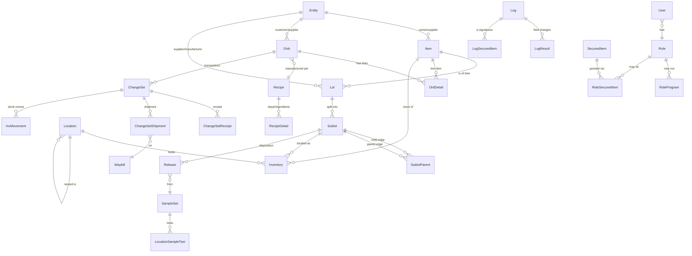

# Phase 0 — Schema & Data Report

**Project:** Internal replacement for the legacy Mar-Kov CMS (Chemical Management System)
**Source analysed:** Live legacy SQL Server database `CMS` (read-only)
**Date:** 2026-06-17
**Status:** For review. No application code has been written. This report + the [Architecture Proposal](ARCHITECTURE.md) are the gate before any build work begins.

---

## 1. Executive summary

The legacy system is **Mar-Kov CMS**, a regulated-industry MES/ERP for batch manufacturing of chemicals and pharmaceuticals. The production database is healthy, well-structured, and very much alive (most recent logged operation: **today**, ~600 logged operations/day).

Headline numbers:

| Metric | Value |
|---|---|
| User tables | **342** (all in `dbo`) |
| Views | 1,015 |
| Stored procedures | 510 |
| Scalar / table-valued functions | 352 / 89 |
| Foreign keys | 426 |
| Triggers | 87 |
| Sequences | 1,949 |
| Approx. total rows | ~34.1 million |
| SQL Server | 2016 SP2 (Developer Edition), compat target fine for 2019/2022 |
| Audit history span | 2014-01-24 → present (live) |

**Read-only access is confirmed and structurally enforced.** Our login (`sds_readonly`) has `SELECT` only; `INSERT`/`UPDATE`/`DELETE` are denied at the database level. We cannot write to the legacy DB even by mistake.

The schema is **cleaner and more consistent than the "dated enterprise app" reputation suggests.** It is built on a small number of strong, reusable patterns (a universal *party* table, a universal *order* table, a transaction-envelope + command-log audit model, and a sublot-genealogy graph). Understanding those ~6 patterns unlocks ~80% of the 342 tables. This is good news: it means **schema parity is realistic**, and a faithful, compatible new schema is achievable.

The biggest *technical* findings that shape the build:

1. **No native change-data-capture.** There is no CDC, no Change Tracking, and no `rowversion`/`timestamp` columns. Incremental sync must be driven off the existing **`Log` audit trail** (which records every change) plus per-row `Version` integers, with checksum reconciliation. (See §9.)
2. **Passwords are legacy SHA-1** (`User.Password varchar(40)`). These cannot and should not be carried into the new system as-is. (See §7 and the Architecture Proposal.)
3. **A mature 21 CFR Part 11 security & e-signature model already exists** and maps almost one-to-one onto the brief's §5 requirements. We should preserve its *concepts* faithfully while modernising its administration. (See §7.)
4. **Many features in the vendor's surface are unused in this installation** (EDI, Visits, Harvest/cannabis, Capacity Planning tables, the `SDS*` tables, Workflow). This lets us prioritise honestly — see [FEATURE_PARITY.md](../FEATURE_PARITY.md).

---

## 2. Discovery method

All findings below come from querying the live database through the read-only MCP SQL connection. Nothing was inferred without verification against the actual tables, except where explicitly flagged as an assumption.

Sources of authority used, per the brief:
1. **Live legacy DB** — source of truth for what data/relationships exist.
2. **Release notes 7.16–7.22** — current intended behaviour (consulted on demand).
3. **2018 User Guide** — detailed behaviour; its table of contents is preserved at [`docs/discovery/user-guide-toc.txt`](discovery/user-guide-toc.txt) and gives the authoritative functional map (24 chapters).

Reproducibility: the exact introspection queries are listed in [Appendix B](#appendix-b--reproducible-introspection-queries) so any finding can be re-derived.

---

## 3. The six core patterns

Almost the entire schema is built from these. Learn them once.

### 3.1 `Entity` — the universal party
One table models **every organisation and party**: suppliers, manufacturers, customers, ship-tos, bill-tos, salesmen, ship-vias, warehouses, labs, divisions, and the installation/site itself. Role is expressed with boolean flags rather than separate tables:

`IsSupplier, IsManufacturer, IsLab, IsWarehouse, IsShipTo, IsBillTo, IsSalesman, IsShipVia, IsDivision, IsSite, IsInstallation, IsCMS, IsPriceList, IsRetain` …

An entity can hold several roles at once. `EntityCode` is the natural key; `Entity` (int identity) is the surrogate. `Parent` gives hierarchy (e.g. ship-tos under a customer).

Population today: 926 entities — 154 suppliers, 166 manufacturers, 701 ship-tos, 345 bill-tos (≈ customers), 32 ship-vias, 13 salesmen, 3 warehouses, 1 site. (No rows flag `IsLab`/`IsDivision`/`IsPriceList` in this install.)

> **Customers** are not a separate flag — a customer is an Entity acting as `IsBillTo`/`IsShipTo`. This matches the User Guide, where "Customers" live under Entities (§2.2.2).

### 3.2 `Item` — the universal catalogue item
One table models **materials, packaged products, package types, packaging prototypes, name-variants, and services**, discriminated by `Item.Context`:

| `Context` | Count | Meaning |
|---|---|---|
| `NAME` | 7,330 | Item name variants / synonyms (multi-lingual & alternate names) |
| `PP` | 7,103 | Packaged Products (finished goods) |
| `SUNDRY` | 6,544 | Regular inventory materials (raw/intermediate) |
| `PROTOTYPE` | 36 | Packaging prototypes |
| `PACKAGE` | 26 | Package types |

`ItemCode` is the natural key. Self-references (`PkgType`, `OuterType`, `PriceAs`, `ReplacedBy`) model packaging hierarchy and substitutions. Rich satellite tables extend it: `ItemChemical` (66 cols of GHS/DG/safety data), `ItemCustom`, `ItemEntity` (item↔supplier/customer cross-refs, 28K rows), `ItemTest` (QA test requirements), `ItemUnit`, `ItemPkg`, `ItemPackagedProduct`, `ItemComponent` (CAS components), `ItemLandingFactor`.

Expiry/retest is driven by `RetestPeriod`, `MaximumLife`, `NoExpiry`. Costing fields live inline: `StandardCost`, `ReplacementCost`, `StandardPurchasePrice`, `SalesPrice`, `TargetPrice`.

### 3.3 `Ordr` / `OrdDetail` — the universal order
**Purchasing, manufacturing (batching), packaging, and sales/shipping are all the same two tables**, discriminated by `Ordr.Context`:

| `Ordr.Context` | Count | Order type |
|---|---|---|
| `MFPP` | 27,978 | Manufacturing — **Packaging** orders |
| `MFBA` | 27,480 | Manufacturing — **Batching** orders |
| `SH` | 15,606 | **Shipping / Sales** orders (incl. 127 with `ProcessingType='Ship'`) |
| `PO` | 4,087 | **Purchase** orders |

`Ordr` (105 columns) carries every cross-cutting concern: parties (`Entity`, `BillTo`, `ShipTo`, `Salesman`, `Division`), a `Recipe` link (manufacturing), execution/preweigh/packaging **zones** (→ `Location`), tax (3 tax groups), freight, terms, `IsQuote`, recurring-order fields (`Repeat`, `ForPeriod`), batch fields (`ActualBatchSize`, `ManfLot`, `LabourHours`, `MachineHours`), holds (`UserHold`, `ExecutionHold`, `CreditHold`), and `SecurityGroup` for row-level scoping.

`OrdDetail` (118 columns, 505K rows) is the line item for all order types — PO lines, batch ingredients/components, packaging lines, shipping lines. `Parent` (self-ref) + `Phase` model the recipe/BOM hierarchy inside an order. Many columns are batch-execution specifics: `QtyReqd/Committed/Used/Yield`, `MustPreweigh`, the `AdjLT/AdjGT…` over/under-dispense tolerance machinery, `ExecOrder/ExecStatus`, `RecipeDetailReference`. Draft/revision editing has parallel `OrdrEdit` / `OrdDetailEdit` tables (the "Order Edits" feature).

### 3.4 `ChangeSet` — the transaction envelope
Every inventory-affecting transaction (receipt, shipment, transfer, adjustment, disposal, manufacturing consume/produce) is wrapped in a `ChangeSet`. Key design feature: **`ChangeSet.ReverseChangeSet` self-reference** — reversals are first-class, which is exactly how a regulated system should handle "undo" (you never delete; you post a reversing changeset). Specialisations: `ChangeSetReceipt`, `ChangeSetShipment`, `ChangeSetMFReceipt`, `ChangeSetReturn`. `ChangeSet` links to `Ordr` and to the financial `Trans`.

### 3.5 `Log` family — the command-log audit trail
This is the audit backbone and it is excellent. Each user operation writes a `Log` row capturing the **full request and result as XML**, plus `LoggedInUser`, `StartTime/EndTime`, `Workstation`, `Application`, `Program`, `Action`, `TransDate`, `AppVersion`. Hanging off it:

- **`LogResult`** (24M rows) — one row per field written: `(Log, Step, TableName, FieldName, FieldValue)`. This is the granular, field-level "what changed" history.
- `LogRequest` (2M) — multi-step request payloads.
- `LogCompleted`, `LogTransDate`, `LogChange` — completion/date/change linkage.
- **`LogSecuredItem`** (283K) — the **electronic-signature & permission ledger** (see §7.3).

Operational tables point back at the responsible operation via a `Log` FK (`InvMovement.Log`, `LcnMovement.Log`, `TransDetail.Log`, `Release.Log`, `OrdDetailExecComment.Log`). This is effectively an event-sourced audit overlaid on a mutable relational model — very useful both for traceability and for our incremental-sync design.

### 3.6 The genealogy graph (`Lot` → `Sublot` → `SublotParent`)
See §5 — this is important enough for its own section.

---

## 4. Functional domain → table map

The 342 tables grouped by business domain (row counts as of discovery). This is the backbone of [FEATURE_PARITY.md](../FEATURE_PARITY.md). High-volume/empty tables are annotated. ("0 rows" = feature present in product but unused in this installation.)

### Master data
`Entity` (926), `Item` (21,039), `ItemEntity` (28,675), `ItemChemical` (13,647), `ItemCustom` (13,647), `ItemTest` (13,437), `ItemPackagedProduct` (7,103), `ItemUnit` (2,265), `ItemPkg` (62), `ItemComponent` (0), `ItemKitID` (0), `ItemLandingFactor` (0), `Address` (1,509), `AddressReference` (59,857), `Unit` (16), `Currency` (2), `Terms` (22), `PriceVersion` (615), `PriceDetail` (15,745), `Component` (1,948), `ChemicalCompound` (1,935), GHS/safety lookups (`GhsCode` 934, `GhsClassification` 222, `UNNumber`, `DGClass`, `PackingGroup`, `PPE`, `SafetyCategory`, `DisposalGroup`, `PBOEL`, …), `Territory`, `TruckRoute`, `State` (66), `Country` (5).

### Inventory & genealogy
`Lot` (55,228), `Sublot` (55,228), `SublotParent` (genealogy edges), `Location` (97,778 — containers), `Inventory` (37,932), `InvMovement` (600,715), `InvMovementDtl` (959,576), `LcnMovement` (97,935), `LcnMovementDtl` (98,105), `LotIngredient` (259,688), `LotComponent` (93), `ChangeSet` (122,027) + specialisations, `InventoryCount` (1,490) / `InventoryCountDetail` (21,037), `StorageRule` (9), `LocationGroup`, `LocationVessel`, `StorageHistory`.

### Costing
`InventoryCost` (71,113), `InventoryUnitCost` (68,259), `InventoryUsed` (226,869 — FIFO consumption links), `OrdrItemCost` (270,805), `CostChange` / `CostChangeDetail`, `LandingFactor`.

### Recipes (manufacturing)
`Recipe` (19,005), `RecipeDetail` (176,774), `RecipeDetailTest` (183), `RecipeDetailParams`, `RecipeDetailResource`, `RecipeDetailPlcParam`, `RecipeReplacement` (54) / `RecipeReplacementRecipe` (3,418) / `RecipeReplacementIngredient`, `RecipeApprovedAddition`. (Batching vs Packaging recipes and their Libraries are `Context`-discriminated like orders.)

### Orders & execution
`Ordr` (75,151), `OrdDetail` (504,959), `OrdDetailTest` (72,520), `OrdDetailPricing` (48,627), `OrdDetailCommit` (27,598), `OrdrItemCost`, `OrdDetailResource`, `OrdDetailParams`/`OrdDetailParamValue`, `OrdDetailPlcParam`, `OrdDetailExecComment`, `OrdDetailLink`, `OrdrCustom`, `OrdrApprovedAddition`, `InstructionSublot`, `OpcCommingle`, `PalletTracking` (17,682). Edit/revision: `OrdrEdit`, `OrdDetailEdit`, `OrdDetailTestEdit`, `OrdDetailParamsEdit`, `OrdDetailResourceEdit`, `OrdDetailPlcParamEdit`, `OrdrApprovedAdditionEdit`.

### LIMS / QA
`SampleSet` (25,144), `SampleSetLocationSample` (25,144), `SampleSetTestGroup` (25,144), `SampleSetTestSpec` (68,856), `LocationSample` (25,144), `LocationSampleTest` (68,856), `LocationSampleSource` (25,144), `Release` (80,370), `ReleaseCofA` (54,146), `Test` (35), `TestGroup` (4), `TestGrouping`, `TestSchedule`, `LimsTestGroup`, `ItemTest`.

### Sales & shipping
`Waybill` (17,357), `WaybillInProcess` (52,395), `WaybillTrackingNumber` (17,753), `WaybillGrouping`, `Bill` (4,491) / `BillDetail` (8,989), `Trans` (22,122) / `TransDetail` (55,295) / `TransDate` (4,748) / `TransPayment` / `TransConsolidate`, `ShippingMethod`, `FreightService`, `PaymentMethod`, `ShippingOrderUser`.

### Planning (Supply/Demand, MRP, Capacity)
`PlanTrace` (3,637), `PlanTraceInProgress`, `PlanLastCalculated`, `OrdPlan` / `OrdPlanDetail`, `CapacityPlan` (0), `Reference` / `ReferenceDetail` (118,223) / `MemoReference` (27,759).

### Resources & maintenance
`Resource` (rooms/vessels/pails/equipment/scales, self-nesting), `ResourceControl`, `ResourceValve`, `ResourceCalendar`, `ResourceCategory`, `MaintDetail`, `MaintScheduleItem` / `MaintScheduleItemSpec`, `MaintScheduleGroup` / `MaintScheduleGroupItem`.

### Documents
`Document` (63,040), `Documentation` (17,991), `EntityDocument` (4,266), `DocumentsSent`, `ReviewDocument*`, `VisitDocument`. `SDS` / `SDSDetail` / `SDSLibrary*` exist but are **empty** (the separate SDS authoring tool likely stores elsewhere — relevant to the future integration in brief §7).

### Accounting
`AccountCode` (27), `GLCode` / `GLGroup` / `GLGroupCode`, `TaxRule` (3), `ItemTaxGroup` / `EntityTaxGroup`, `CurrencyRate`, `QuickBooksTransactions`, `QuickBooksBuildDependency`, `ReconciliationStatus`.

### Security, audit & workflow
`User` (23), `Role` (4), `RoleProgram` (1,022), `Program` (917), `SecuredItem` (80), `RoleSecuredItem` (114), `SecuredItemCondition`, `SignatureMeaning`, `AssignableRole` (3), `SecurityGroup` (6), `Approval` / `ApprovalDetail` / `RoleApprovalDetail`, `Workflow` / `WorkflowDetail` (0), `UserArea` / `UserSite` / `UserGroup` / `UserHold`, `Log` family (see §3.5). `LicenseSession`, `stat_LoggedInUsers`.

### Configuration
`ParamsCMS`, `ParamsBatchExecution` (42 cols), `ParamsInventory`, `ParamsOrder`, `ParamsRecipeManager`, `ParamsUser`, `ParamsMail`, `ParamsHost`, `ParamsPrint`, `ParamsPurchaseReceipt`, `ParamsLogJournal`, `ParamsVisit`, `ParamsAverageTareWeight`, `Workstation` / `WorkstationPrint` / `WorkstationScale` / `WorkstationScandocParams`, `Job` / `JobStep` (scheduled procedures), `Vocabulary` (4,298 — multi-language static text), `LabelFormat` / `LabelGroup`, `Report` / `ReportParams`.

### Present-but-unused in this install (0 rows — deprioritise)
EDI (`Edi*`), Visits/visitor-management (`Visit*`, `VisitsQuestionnaire*`, `Appointments`, `Badge`), Harvest/agricultural (`Harvest*`, `LotCorn` has 0), `CapacityPlan`, `Workflow`/`WorkflowDetail`, `SDS*`, `TallySheetReport*`, most `Custom*` extension tables, `CTFA_*` (cosmetic INCI naming).

> Full machine-readable inventory (all 342 tables w/ row & column counts) is regenerable via the query in Appendix B.1.

---

## 5. Genealogy & traceability model (recall backbone)

This is the most important model for the brief's §6 recall requirement, so it gets detail.

```
Item ──< Lot ──< Sublot >──< SublotParent (Parent, Sublot)   ← child↔parent edges (many-to-many = blending/splitting)
                   │
                   ├──< Inventory (Sublot, Location, Item, Qty, Status)   ← live stock-on-hand
                   │         │
                   │         └── Location (container; InLocation self-ref = nesting/assemblies)
                   │
                   ├──< Release (QA disposition: Grade, Purity, ExpiryDate, ReleasedBy, Log)
                   │         └── SampleSet ──< LocationSample / LocationSampleTest  (LIMS)
                   │
                   └──< ChangeSetReceipt / ChangeSetShipment / InvMovement ...  (transactions touching this sublot)
```

Key tables and what they mean:

- **`Lot`** (PK `Lot varchar(50)`, natural key) — a received or produced lot of an `Item`, with `Supplier`/`Manufacturer` + their lot numbers (`SupLot`/`ManfLot`), `ManfDate`/`ReceivedDate`/`DestructDate`/`CofADate`, controlled-substance reconciliation fields, `ReduceTesting`.
- **`Sublot`** (PK `Sublot int`) — a sub-quantity/instance of a lot; carries the QA `Release` and a `SublotCode`.
- **`SublotParent`** `(Sublot, Parent)` — **the genealogy edge table.** Many-to-many: one sublot can have multiple parents (blending) and multiple children (splitting/dispensing). Forward trace (recall "where did it go") and backward trace (recall "what's in it") are graph traversals over this table.
- **`Inventory`** `(Sublot, Location, Item, Qty, Status)` — current quantity of a sublot in a container.
- **`Location`** — a physical container or storage location; `InLocation` self-reference builds nested assemblies/pallets.
- **`Release`** — QA disposition gate; sets `Grade`, `Purity`, `ExpiryDate`, links to the `SampleSet` and to the audit `Log`.
- **`LotIngredient`** / **`LotComponent`** — declared composition (ingredient %, CAS components) for labelling/regulatory.

**Recall workflow (new system):** given any `Lot`/`Sublot`/`Location`, traverse `SublotParent` downward to every descendant sublot, intersect with `ChangeSetShipment`→`Waybill`→`Ordr.ShipTo` to produce the **affected-customers** list, and upward to every ancestor raw lot/supplier. The legacy "Trace Children / Trace Parents" viewers (User Guide §4.12, §23.1.10–13) are exactly this; we will reimplement them as a single fast recursive-CTE / graph query with a one-click "Recall report".

---

## 6. Core ERD (condensed)



---

## 7. Security, audit & electronic-signature model

This already implements, at the database level, almost everything the brief's §5/§6 asks for. We will **preserve the model's concepts and reimplement the administration & enforcement cleanly.** Mapping to brief §5:

### 7.1 Users → Roles → Programs (screen access)
- **`User`** — `User` (username, PK), `DisplayName`, `Email`, `Role`, `UserGroup`, `DefaultArea`, `Disabled`, `Approver`, `Language`, `Password`. Multi-role/multi-site is layered on via `UserArea`/`UserSite` (a user can hold different roles in different areas/sites).
- **`Role`** + **`RoleProgram`** `(Role, Program, Allow, RunAtStartup)` — which programs/screens a role may run. **`Program`** is the catalogue of 917 screens (with `Folder` = menu grouping, used as our module map).
- **`AssignableRole`** `(ParentRole, Role)` — delegated administration: which roles a role is allowed to grant. (Brief §5 "assignable roles".)

### 7.2 Secured items + response levels (the heart of it)
**`SecuredItem`** targets a `Dataset` / `TableName` / `FieldName` / `Method` — i.e. **field-, table-, action-, and event-level** controls (User Guide §21.4.2–5), exactly as the brief requires. Each secured item declares its **response level** via three bits:

| `Reason` | `Signature` | `Witness` | Meaning (User Guide §21.5) |
|:---:|:---:|:---:|---|
| ✓ | | | Reason only |
| | ✓ | | Electronic signature required |
| | ✓ | ✓ | Signature **and** witness required |
| | | ✓ | Witness required |

Plus `Condition`/`SecuredItemCondition` (conditional rules), `ExecutionOrder`, `AccessDeniedMessage`, `Disabled`/`Hidden`, and signature/witness description text. **`RoleSecuredItem`** `(Role, SecuredItem, Allow, AllowWitness, SecuredItemCondition)` grants it to a role (optionally witness-only, optionally per-condition). **`SignatureMeaning`** is the catalogue of signing meanings (Part 11).

This is a faithful basis for the brief's "reason / signature / witness / signature+witness" requirement **and** the "supervisor override / approve-on-behalf" requirement (a privileged role with `Allow` on the secured item can sign in place).

### 7.3 The electronic-signature ledger — `LogSecuredItem`
Every secured action is recorded with: the affected `Dataset/TableName/FieldName/Method`, `User` + `UserFullName` + **`UserExplanation`**, `Witness` + `WitnessFullName` + **`WitnessExplanation`**, `Comment`, `SecurityGroup`, and **`MasterTable`/`MasterTableId`** (the business record affected). This is precisely the tamper-evidence + "who was blocked / who approved / what / why / signatures" audit the brief demands. We will carry this forward and additionally make it cryptographically tamper-evident (hash-chaining — see Architecture Proposal §6).

### 7.4 Approvals & workflow
- **`Approval`** / **`ApprovalDetail`** `(SignOrder, Email, CommentRequired, …)` — ordered, multi-step sign-off chains.
- **`RoleApprovalDetail`** — which roles satisfy which approval step.
- **`Workflow`** / **`WorkflowDetail`** — gated transitions (e.g. order completion). *Currently 0 rows in this install* — workflow chains aren't configured here today, but the model exists and the User Guide §21.7 documents Start/Status. We'll build it; it just isn't exercised yet.

### 7.5 Row-level scoping
**`SecurityGroup`** tags `Item`, `Ordr`, `Recipe`, `StorageRule`, `Approval`, `Workflow` — data-segregation by group. We'll preserve this as row-level authorization.

### 7.6 ⚠️ Security findings to act on at cutover
1. **`User.Password` is `varchar(40)` = SHA-1 hex** (unsalted, by the look of it). We will **not** reuse this scheme. Options: (a) import users disabled and force first-login reset; (b) store the legacy hash, verify once on first login, then transparently re-hash to Argon2id. Recommend (a) for safety, (b) for convenience — decision needed (see §10).
2. There is no MFA/SSO in the legacy model — greenfield in the new system (brief §5).
3. Only **23 users / 4 roles** today — administration is small, so a clean re-grant during cutover is feasible rather than importing the full grant matrix verbatim. (We can import it as a starting point.)

---

## 8. Proposed new schema

**Guiding principle (per brief §2): mirror the legacy schema unless there's a clear, documented reason to diverge; where we diverge, provide a compatibility view/mapping.** Concretely:

### 8.1 Keep (mirror 1:1)
The core transactional spine — `Entity`, `Item` (+ satellites), `Ordr`/`OrdDetail`, `Lot`/`Sublot`/`SublotParent`, `Location`, `Inventory`, `ChangeSet*`, `Recipe`/`RecipeDetail`, the LIMS tables, costing tables — keep the same table and column names and the same keys. This preserves compatibility with the other Claude-Code-built tools that read the legacy DB and makes the import a near-straight copy.

### 8.2 Improve (diverge, with a compatibility view)
Where we diverge we will expose a `legacy`-schema **view** that presents the original shape, so external tools and the import reconciler keep working. Proposed divergences:

| Area | Legacy | New | Why | Compatibility |
|---|---|---|---|---|
| Auth | `User.Password` SHA-1 | `users` with Argon2id hash, MFA, SSO subject, lifecycle status | Security (brief §5) | `User` view projects legacy columns (no hash exposed) |
| Audit integrity | `Log*` append-by-convention | same + per-row hash chain, enforced append-only | Tamper-evidence (brief §6) | superset; legacy columns preserved |
| Typing | string discriminators (`Context='MFBA'`) | keep column **and** add a FK'd `order_type` lookup + CHECK | Readability, referential safety | `Context` column retained verbatim |
| Enumerations | free `varchar` status codes (`Status varchar(6)`) | same columns + lookup tables + CHECK constraints | Data quality | values unchanged |
| Soft refs | some relationships not FK-enforced (426 FKs for 342 tables) | add missing FKs where data supports it | Integrity | additive only |
| Money/qty | `float` for quantities | keep `float` for parity but validate; `money`→`decimal(19,4)` | Avoid rounding surprises | view casts back if needed |

Every divergence will be listed in a `SCHEMA_DEVIATIONS.md` with rationale and the compatibility object, so the "documented reason to diverge" rule in the brief is satisfied per-change.

### 8.3 Net effect
The new DB is **a superset of the legacy schema**: same tables/columns (so import is trivial and external tools stay compatible) **plus** lookup tables, constraints, modern auth tables, and hardened audit — all additive or view-backed.

---

## 9. Import / sync design

Required properties (brief §2): one-command + schedulable, idempotent, resumable, incremental where possible, full initial load + ongoing top-ups, with a reconciliation report (row counts, checksums, rejected rows). Read-only source, never write back.

### 9.1 Constraint that shapes everything
**There is no CDC, no Change Tracking, and no `rowversion` on the source**, and we cannot add them (read-only). So we cannot ask SQL Server "what changed since X". We derive change three ways, in priority order:

1. **Audit-log-driven deltas (primary).** The `Log` table timestamps every operation (`TransDate`/`StartTime`) and `LogResult` records the exact `TableName`/`FieldName`/keys touched. Keep a per-run high-water mark on `Log`. On each incremental run, read new `Log` rows since the mark, collect the set of affected tables + business keys, and re-pull just those rows. This is precise and cheap (~600 ops/day).
2. **`Version` integer columns (secondary / validation).** Most core tables have a `Version int` that increments on change. Compare source `Version` to target to catch anything the log-walk missed.
3. **Checksum reconciliation (safety net).** Periodically (nightly/weekly) compute per-table row counts and a hashed checksum of business columns on both sides and diff. Anything divergent is re-pulled. Small/reference tables are simply re-copied wholesale (cheap).

### 9.2 Mechanics
- **Idempotent:** every upsert keyed on the natural key (e.g. `ItemCode`, `Lot`, `EntityCode`) or the legacy surrogate where that's the stable identity; re-running yields the same target state. A stable `HostIdMap`-style mapping table (the legacy DB already has `HostIdMap`, 11,368 rows — we mirror this idea) preserves surrogate-key correspondence.
- **Resumable:** import runs in batched, checkpointed units per table; a `sync_run` + `sync_table_progress` ledger records the last committed batch so a crash resumes mid-table.
- **Ordered:** tables loaded in FK-dependency order (topological sort of the 426 FKs) so references resolve; or deferred-constraint load then validate.
- **Rejected rows:** rows failing validation/constraints are written to a `sync_rejects` table with the reason, never silently dropped.
- **Full vs incremental:** `--mode full` (initial load / disaster reseed) vs `--mode incremental` (log-driven top-up). Both share the same upsert + reconcile code paths.
- **Reconciliation report:** every run emits per-table `source_rows / target_rows / inserted / updated / rejected / checksum_match`, plus overall pass/fail. Stored and surfaced in the admin UI.

### 9.3 Scale sanity
~34M rows total, but 26M of those are the `LogResult`/`LogRequest` audit detail. Initial full load is dominated by audit history; we can (a) load audit history once in the background, and (b) for day-to-day, only the operational tables (~8M rows) need to stay hot. Incremental runs touch only the day's ~600 operations' worth of rows — sub-second to seconds.

---

## 10. Risks, ambiguities & open questions

These need a decision from you (none block starting the Architecture review):

1. **Password migration strategy** — force-reset all users at cutover (safest), or verify-once-then-rehash the legacy SHA-1 (smoother)? (§7.6)
2. **Cutover model** — is the new system intended to (a) *run alongside* the legacy system reading a synced copy for a while, or (b) *replace* it at a hard cutover after which the new DB is authoritative and the legacy import stops? This affects whether sync is one-shot or ongoing-bidirectional-aware. The brief implies one-way read-only import → independence, which I'll assume unless told otherwise.
3. **Audit history depth on day one** — import all audit history back to 2014 (~26M rows) into the new system, or import operational data + recent audit (e.g. 2 years) and archive the rest? (Recall/Part 11 may require full history — please confirm retention requirements.)
4. **Unused features** — confirm we can deprioritise the 0-row areas (EDI, Visits, Harvest, Capacity Planning, the empty `SDS*` tables, Workflow-as-configured). I'll keep schema parity for them but not build UI until needed.
5. **Multi-site / Areas** — this install has 1 site, 3 warehouses. Confirm whether the new system must support multi-site/multi-tenant from day one or single-site is fine initially (the model supports multi).
6. **SDS tool integration** — the `SDS*` tables are empty here; the separate SDS tool presumably uses its own store. For the future link (brief §7) I'll need to know where the SDS tool keeps its data and its item-key convention. Not now — just flagging.
7. **`float` quantities** — the legacy system stores quantities as `float`. We'll keep parity but I recommend validating critical quantity math; confirm you're comfortable retaining `float` for column-compatibility (vs migrating to `decimal`, which would break exact column parity).

---

## Appendix A — key table cheat-sheet

| Table | Rows | Role |
|---|---:|---|
| `Entity` | 926 | Universal party (supplier/customer/etc.) |
| `Item` | 21,039 | Universal catalogue item (Context-typed) |
| `Ordr` / `OrdDetail` | 75K / 505K | Universal order (PO/MFBA/MFPP/SH) |
| `Lot` / `Sublot` / `SublotParent` | 55K / 55K / — | Genealogy graph |
| `Location` / `Inventory` | 98K / 38K | Containers / live stock |
| `ChangeSet` (+ReverseChangeSet) | 122K | Transaction envelope w/ reversals |
| `Log` / `LogResult` / `LogSecuredItem` | 661K / 24M / 283K | Audit trail / field history / e-sig ledger |
| `Recipe` / `RecipeDetail` | 19K / 177K | Manufacturing recipes |
| `Release` / `SampleSet` | 80K / 25K | QA disposition / LIMS |
| `User`/`Role`/`SecuredItem`/`RoleSecuredItem` | 23/4/80/114 | Security model |

## Appendix B — reproducible introspection queries

**B.1 Full table inventory (row + column counts, PK presence):**
```sql
SELECT t.name AS table_name,
  SUM(CASE WHEN p.index_id IN (0,1) THEN p.rows ELSE 0 END) AS row_count,
  (SELECT COUNT(*) FROM sys.columns c WHERE c.object_id = t.object_id) AS col_count,
  CASE WHEN EXISTS (SELECT 1 FROM sys.indexes i WHERE i.object_id=t.object_id AND i.is_primary_key=1) THEN 1 ELSE 0 END AS has_pk
FROM sys.tables t JOIN sys.partitions p ON t.object_id=p.object_id AND p.index_id IN (0,1)
GROUP BY t.name, t.object_id ORDER BY row_count DESC;
```

**B.2 Full foreign-key graph:**
```sql
SELECT OBJECT_NAME(fk.parent_object_id) AS from_table, cp.name AS from_col,
  OBJECT_NAME(fk.referenced_object_id) AS to_table, cr.name AS to_col
FROM sys.foreign_keys fk
JOIN sys.foreign_key_columns fkc ON fk.object_id=fkc.constraint_object_id
JOIN sys.columns cp ON fkc.parent_object_id=cp.object_id AND fkc.parent_column_id=cp.column_id
JOIN sys.columns cr ON fkc.referenced_object_id=cr.object_id AND fkc.referenced_column_id=cr.column_id
ORDER BY from_table, from_col;
```

**B.3 Column-level data dictionary (any table set):**
```sql
SELECT TABLE_NAME, ORDINAL_POSITION, COLUMN_NAME, DATA_TYPE,
  COALESCE(CHARACTER_MAXIMUM_LENGTH, NUMERIC_PRECISION) AS len, IS_NULLABLE, COLUMN_DEFAULT
FROM INFORMATION_SCHEMA.COLUMNS WHERE TABLE_NAME IN (/* … */) ORDER BY TABLE_NAME, ORDINAL_POSITION;
```

> A complete generated data dictionary for all 342 tables will be produced as `docs/discovery/data-dictionary.md` during the Foundation increment (it's mechanical; deferred to keep this report readable).
